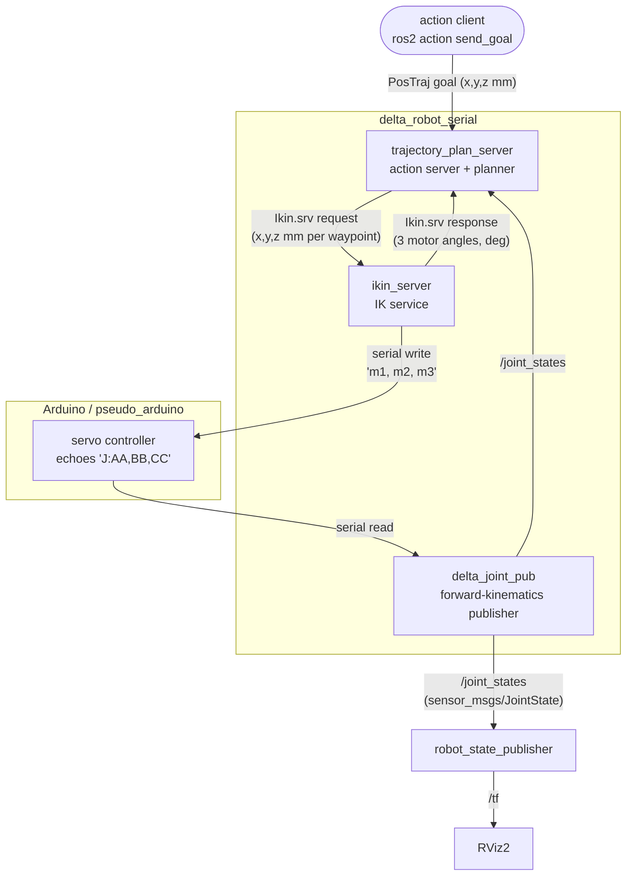

# Delta Robot — ROS 2 Architecture & Operation

A reference for the ROS 2 (Jazzy) control stack for a 3‑DOF delta robot driven over a
serial link to an Arduino. It covers the packages, nodes, interfaces, topics, the serial
protocol, and — in depth — the **inverse kinematics** and **trajectory generation**.

---

## 1. Workspace layout

```
colcon_ws/
└── src/
    ├── delta_robot_serial/        # application logic (nodes, interfaces, kinematics)
    │   ├── src/                    # pseudo_arduino, delta_joint_pub, ikin_server, trajPlan_actionServer
    │   ├── include/                # direct_kinematics.h, inverse_kinematics.h, bundled Eigen
    │   ├── srv/Ikin.srv            # IK service definition
    │   └── action/PosTraj.action   # trajectory action definition
    ├── delta_robot_description/    # URDF, meshes, RViz config, all launch files
    │   └── launch/                 # Pseudo/Arduino × base/Traj + JointStatePublisher
    └── serial/                     # vendored wjwwood cross-platform serial library
```

Three packages:

| Package | Build type | Role |
|---------|-----------|------|
| `delta_robot_serial` | `ament_cmake` + `rosidl` | Nodes, custom `srv`/`action`, kinematics headers |
| `delta_robot_description` | `ament_cmake` | URDF, meshes, RViz config, launch files (bringup) |
| `serial` | `ament_cmake` | Cross-platform serial port library (dependency of the above) |

---

## 2. System data flow

The stack is a **closed loop**: a Cartesian target flows down to motor angles and out the
serial port; the echoed angles flow back up through forward kinematics to a visualized joint
state, which the planner also uses as feedback.



Two feedback paths worth noting:
- **`ikin_server` → serial → `delta_joint_pub` → `/joint_states`**: the real state loop.
- **`/joint_states` → `trajectory_plan_server`**: the planner reads current state to plan
  from where the robot actually is, and to test convergence to the goal.

---

## 3. Nodes

### 3.1 `pseudo_arduino` (simulation only)
Emulates the Arduino so the whole stack runs with no hardware.

- **On startup** it shells out to `socat` to create a linked pseudo-terminal (PTY) pair:
  `$HOME/socatpty1` ↔ `$HOME/socatpty2`. The *computer* side (`socatpty1`) is opened by
  `delta_joint_pub` and `ikin_server`; the *arduino* side (`socatpty2`) is opened by this node.
- **Timer (20 ms)**: reads target angles from `socatpty2`, slews `current_angle` toward the
  target at `step_size` = 1°/cycle (so the virtual robot moves gradually, not instantly),
  then echoes the current angles back as a `J:AA,BB,CC\r\n` frame — but only if all three are
  within `[0, 90]°` (mirrors the servo's mechanical range).
- **Parameters**: `baudrate` (default 115200). Port names are fixed to `socatpty1/2` by design.

### 3.2 `delta_joint_pub` (forward kinematics → visualization)
- **Parameters**: `baudrate` (115200), `serial_port` (`$(env HOME)/socatpty1` or `/dev/ttyUSB0`).
- **Timer (20 ms)**: reads a 12-byte `J:AA,BB,CC\r\n` frame, parses the three motor angles
  (degrees), runs `direct_kinematics()`, and publishes a `sensor_msgs/JointState` on
  **`/joint_states`** with the 12 hard-coded joint names matching `urdf/delta_robot.urdf`.
- **Publishes**: `/joint_states`.

### 3.3 `ikin_server` (inverse kinematics service + serial output)
- **Parameters**: `baudrate`, `serial_port` (same convention as above).
- **Service**: **`/ikin_server`** (`delta_robot_serial/srv/Ikin`). Request = Cartesian
  position (mm); response = the three driven motor angles (deg).
- On each call it runs `inverse_kinematics()` for the three arms (α = 0°, 120°, 240°),
  rejects NaN (unreachable) solutions — filling the response with `NaN` so the client can
  detect the failure — and otherwise writes `"m1, m2, m3"` to the serial port.
- **Owns the serial write side**; `delta_joint_pub` owns the read side (both open the same port).

### 3.4 `trajectory_plan_server` (action server + trajectory planner)
Built as an `rclcpp_components` component (`TrajectoryPlanServer`), also exposed as the
`trajPlan_action_server` executable.

- **Action**: **`/trajectory_plan`** (`delta_robot_serial/action/PosTraj`).
- **Subscribes**: `/joint_states` (on a dedicated callback group serviced by an internal
  executor, so it can be pumped synchronously while an action is executing).
- **Service client**: `/ikin_server`.
- **Behavior** (see §6): on a goal it plans a smooth Cartesian trajectory from the current
  state to the target, streams each waypoint through the IK service at `f_` Hz, publishes
  feedback, then waits for the measured state to converge within tolerance before succeeding.

---

## 4. Interfaces

### `srv/Ikin.srv`
```
# Request — Cartesian position of the platform, millimetres
float64 x
float64 y
float64 z
---
# Response — driven motor angles, degrees (one per arm)
float64 phi_11
float64 phi_21
float64 phi_31
```

### `action/PosTraj.action`
```
# Goal — target platform position, millimetres
float64 x
float64 y
float64 z
---
# Result — final measured position, millimetres
float64 x
float64 y
float64 z
---
# Feedback — current commanded setpoint, millimetres
float64 x
float64 y
float64 z
```

> **Note on Feedback semantics:** Feedback `x,y,z` carry the *commanded Cartesian setpoint*
> (mm) of the waypoint currently being executed — the same space as Goal/Result. (Earlier the
> feedback carried motor angles in degrees under these position-named fields; that was corrected.)

---

## 5. Topics, services, actions (quick reference)

| Kind | Name | Type | Producer | Consumer |
|------|------|------|----------|----------|
| Topic | `/joint_states` | `sensor_msgs/JointState` | `delta_joint_pub` | `robot_state_publisher`, `trajectory_plan_server` |
| Topic | `/tf`, `/tf_static` | `tf2_msgs/TFMessage` | `robot_state_publisher` | RViz2 |
| Service | `/ikin_server` | `delta_robot_serial/srv/Ikin` | `ikin_server` | `trajectory_plan_server` |
| Action | `/trajectory_plan` | `delta_robot_serial/action/PosTraj` | `trajectory_plan_server` | external client |

### Serial protocol
| Direction | Format | Example | Units |
|-----------|--------|---------|-------|
| Host → Arduino (`ikin_server` writes) | `"m1, m2, m3"` (1 decimal) | `45.0, 30.0, 20.0` | degrees |
| Arduino → Host (`delta_joint_pub` reads) | `J:AA,BB,CC\r\n` (12 bytes, 2 digits each) | `J:45,30,20\r\n` | degrees |

---

## 6. Units cheat-sheet

Getting units right is the subtle part of this stack:

| Quantity | Where | Unit |
|----------|-------|------|
| Action Goal / Result / Feedback `x,y,z` | `/trajectory_plan` | **mm** |
| Ikin service Request `x,y,z` | `/ikin_server` | **mm** |
| Ikin service Response `phi_*` | `/ikin_server` | **degrees** |
| Motor angles over serial | serial link | **degrees** |
| `/joint_states` prismatic joints [0..2] (platform x,y,z) | topic | **metres** |
| `/joint_states` revolute joints [3..11] | topic | **radians** |

`trajectory_plan_server` converts the platform position from metres to millimetres on receipt
(`state_x = 1000 * joint_states.position[0]`), keeping all of its internal math in mm.

Geometry constants (identical in both kinematics headers): proximal link `l_pl_i = 50 mm`,
distal link `l_dl_i = 93 mm`, base offset `a_i = 28 mm`, platform offset `b_i = 20 mm`,
arm angles α = 0°, 120°, 240°.

---

## 7. Inverse kinematics (deep dive)

File: [`include/inverse_kinematics.h`](src/delta_robot_serial/include/inverse_kinematics.h).
`ikin_server` calls it once per arm with the arm's mounting angle α ∈ {0°, 120°, 240°}.

```
inverse_kinematics(double position[3], double alpha_i_deg, double phi[3])
```

The delta robot's three arms are identical, each rotated by α about the base z-axis. Solving
one arm in its own rotated plane and repeating for the three α values gives the three motor
angles. For a single arm:

**Step 1 — out-of-plane angle `phi[2]`.**
```
acos_arg = (x·sinα − y·cosα) / l_dl_i
phi[2]   = acos(acos_arg)          # angle the distal link makes out of the arm's plane
```
`|acos_arg| > 1` ⟹ the point is out of reach ⟹ return NaN.

**Step 2 — reduce to a planar 2-link problem.** Project the target into the arm's working
plane:
```
A = -a_i + b_i + x·cosα + y·sinα   # in-plane horizontal, relative to the base joint
B = -z                             # vertical
a = l_pl_i                         # proximal link length
b = l_dl_i·sin(phi[2])             # distal link projected into the plane
```
We now need the proximal angle θ such that a link of length `a` from the origin, plus a link
of length `b`, reaches `(A, B)`. The reach constraint is a law-of-cosines projection:
```
A·cosθ + B·sinθ = C_a,   with   C_a = (A² + B² + a² − b²) / (2a)
```

**Step 3 — solve with the tangent half-angle (Weierstrass) substitution.** Letting
`t = tan(θ/2)` turns the equation into a quadratic whose closed-form solution is:
```
disc_a = A² + B² − C_a²                       # < 0 ⟹ unreachable ⟹ NaN
phi[0] = 2·atan2( B − √disc_a , A + C_a )      # the DRIVEN motor angle
```
`phi[0]` is normalized to `(−180°, 180°]`. **This is the only value the rest of the system
uses** (`ikin_server` sends `phi[0]` of each arm to the servos).

**Step 4 — passive joint `phi[1]`.** A symmetric solve (`C_b`, `disc_b`) yields the distal
joint angle, then `phi[1] -= phi[0]` makes it relative. `phi[1]` is currently **computed for
completeness but not consumed** by any caller, and its `disc_b` guard duplicates the `disc_a`
reachability test. It is retained for a possible future full joint-state output.

**Branch / assembly mode.** `phi[0]` and `phi[1]` both take the `B − √disc` (minus) root — one
of the two elbow configurations. This choice determines whether `phi[0]` lands inside the
servo's `[0, 90]°` range.

**Range enforcement is downstream, not here.** IK produces a mathematically valid angle in
`(−180, 180]`; the physical `[0, 90]°` servo limit is enforced by `pseudo_arduino` / the real
Arduino, which silently ignore any commanded angle outside that band. So an out-of-range but
mathematically valid pose is dropped at the hardware boundary, not by the IK.

---

## 8. Trajectory generation (deep dive)

File: [`trajPlan_actionServer.cpp`](src/delta_robot_serial/src/trajPlan_actionServer.cpp),
functions `generate_trajectory()` and `executeCB()`.

Key parameters: `T_ = 3.0 s` (nominal move duration), `f_ = 10 Hz` (waypoint send rate, kept
low so the pseudo-Arduino's 1°/cycle slew can track).

### 8.1 Path vs. time law
The motion is **point-to-point along a straight line** between the current position and the
goal. It is *not* a spline through multiple via-points. The geometry is pure linear
interpolation; a **quintic smoothstep** shapes only the *timing* along that line:

```
point(τ) = start + s(τ) · (goal − start)
s(τ)     = 10τ³ − 15τ⁴ + 6τ⁵          # quintic "smootherstep"
```

`s(τ)` rises 0→1 as τ (normalized time) goes 0→1, with **zero first and second derivatives at
both ends** — i.e. the tool starts and stops with zero velocity *and* zero acceleration (bounded
jerk). That is what makes the motion smooth for a physical actuator.

### 8.2 How many waypoints (`N`)
```
distance = ‖goal − start‖
peak_vel = (15/8) · distance / T_      # 15/8 = max of s'(τ), the quintic's peak speed
max_step = peak_vel / f_               # furthest travel in one control tick at peak speed
N        = max( ceil(distance / max_step), 2 )
```
`N` is a **sampling density**, chosen so no single step exceeds `max_step` even where the
profile is fastest (mid-move). Doubling `N` produces the identical motion, sampled more finely.
Guard: `distance < 1e-6` (already at target) ⟹ `N = 1` (avoids a 0/0).

### 8.3 Execution loop (`executeCB`)
1. **Get a fresh start state.** Clear `state_received_`, then manually spin the internal
   executor until a `/joint_states` message updates `state_x/y/z` (3 s timeout → plan from last
   known state).
2. **Plan** the `N` waypoints via `generate_trajectory()`.
3. **Stream** each waypoint:
   - abort if the goal is canceling,
   - call `/ikin_server` (5 s timeout), abort on timeout,
   - if the IK response is valid (not NaN), publish the **commanded waypoint position** as
     feedback and `rate.sleep()` to pace at `f_`; if invalid, abort ("Invalid IK response").
4. **Convergence check.** After the last waypoint, repeatedly read a fresh `/joint_states`
   (up to `max_attempts = 30`) and compute `‖goal − measured‖`. If it drops within
   `tolerance = 5 mm`, `succeed()` with the measured position as the Result; otherwise `abort()`
   with a warning. The loose tolerance and retry budget accommodate the pseudo-Arduino's
   gradual 1°/cycle slew.

### 8.4 Why a dedicated callback group
The `/joint_states` subscription lives on its own `MutuallyExclusive` callback group serviced
by an internal `SingleThreadedExecutor`, created with
`automatically_add_to_executor_with_node = false`. This lets `executeCB` (running in a detached
thread) pump joint-state updates synchronously with `spin_once()` while blocked, without the
component container's executor also consuming those messages.

---

## 9. Launch files

| Launch file | Contents | Use |
|-------------|----------|-----|
| `PseudoArduino.launch` | `pseudo_arduino` + `delta_joint_pub` + `ikin_server` + RSP + RViz + rqt | Simulated base stack (no trajectory) |
| `PseudoArduinoTraj.launch` | includes `PseudoArduino.launch` + `trajectory_plan_server` | Simulated stack with trajectory action |
| `Arduino.launch` | `delta_joint_pub` + `ikin_server` + RSP + RViz + rqt (real port) | Real-robot base stack |
| `ArduinoTraj.launch` | includes `Arduino.launch` + `trajectory_plan_server` | Real robot with trajectory action |
| `JointStatePublisher.launch` | `joint_state_publisher_gui` + RSP + RViz | URDF/visualization only (no serial) |

Structure is a clean 2×2: `{Pseudo, Arduino} × {base, +Traj}`. `pseudo_arduino` appears only in
Pseudo launches; `trajectory_plan_server` only in `*Traj` launches. Both `*Traj` files compose
their base via `<include>` (no duplicated node blocks).

---

## 10. Running it

### Simulation (no hardware)
```bash
cd colcon_ws
colcon build
source install/setup.bash
ros2 launch delta_robot_description PseudoArduinoTraj.launch
```

Send a goal (units: **mm**):
```bash
ros2 action send_goal /trajectory_plan delta_robot_serial/action/PosTraj \
  "{x: 0.0, y: 0.0, z: -103.0}" --feedback
```

Call the IK service directly:
```bash
ros2 service call /ikin_server delta_robot_serial/srv/Ikin "{x: 0.0, y: 0.0, z: -110.0}"
```

### Real robot
```bash
ros2 launch delta_robot_description ArduinoTraj.launch serial_port:=/dev/ttyUSB0 baudrate:=115200
```

### Housekeeping
Because `pseudo_arduino` backgrounds a `socat` process and the action server detaches a thread,
fully stop a launch before relaunching to avoid duplicate servers / stale serial ports:
```bash
pkill -f trajPlan_action_server; pkill -f pseudo_arduino; pkill socat
ros2 daemon stop        # clears stale discovery cache
```
