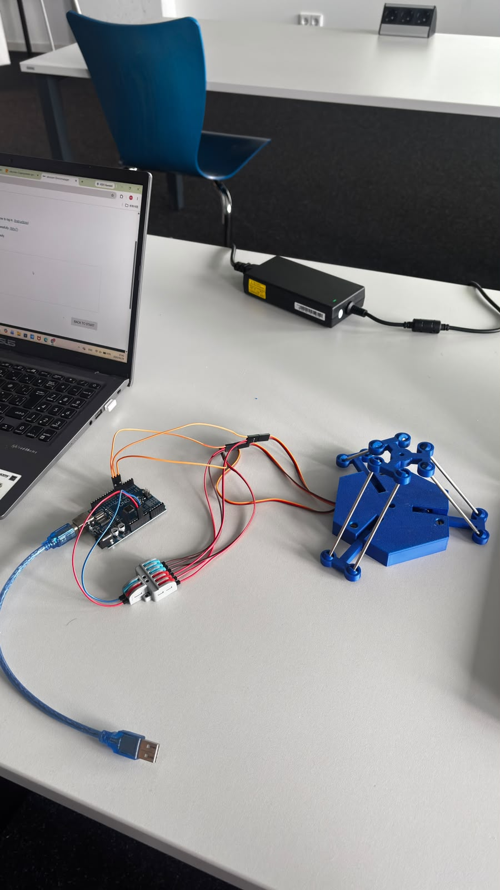

# Delta Robot ROS 2 Control Stack

A ROS 2 (Jazzy) workspace for controlling a **3-DOF delta robot** over a serial link to an Arduino. Built during the [RWTH Aachen International Academy ROS2 Summer School](https://www.academy.rwth-aachen.de/) (June–July 2026).

The stack includes serial communication, inverse/forward kinematics, a trajectory planning action server with cubic spline interpolation, and a pseudo-Arduino node for hardware-free simulation.

<p align="center">
  
</p>
<p align="center">
  <em>fully assembled delta robot.</em>
</p>
---

## Features

- **Closed-loop control**: Cartesian goals → inverse kinematics → serial → Arduino → serial read → forward kinematics → joint state visualization in RViz
- **Multi-point trajectory planning**: pass `n` via points; a natural cubic spline with quintic smoothstep timing generates a smooth, C²-continuous path
- **Hardware-in-the-loop simulation**: a `pseudo_arduino` node creates a virtual serial link via `socat`, so the entire stack runs without hardware
- **Modular launch structure**: clean `{Pseudo, Arduino} × {base, +Traj}` launch matrix

---

## Architecture

```
Action goal (x[], y[], z[])       n Cartesian via points (mm)
  → trajPlan_actionServer         cubic spline + quintic time law
  → /ikin_server service          x, y, z → 3 motor angles (deg)
  → serial write                  "m1, m2, m3\n"
  → Arduino / pseudo_arduino
  → serial read (delta_joint_pub)
  → direct_kinematics             motor angles → full joint state
  → /joint_states topic
  → robot_state_publisher → RViz
```

### Packages

| Package | Role |
|---------|------|
| `delta_robot_serial` | Nodes, custom `srv`/`action`, kinematics headers |
| `delta_robot_description` | URDF, meshes, RViz config, launch files |
| `serial` | Vendored [wjwwood/serial](https://github.com/wjwwood/serial) library |

### Nodes

| Node | Description |
|------|-------------|
| `ikin_server` | Provides the `/ikin_server` service. Computes inverse kinematics per arm (α = 0°, 120°, 240°) using a Weierstrass half-angle substitution. Writes motor angles to serial. Rejects NaN (unreachable) solutions. |
| `delta_joint_pub` | Reads motor angles from serial, runs forward kinematics, publishes `sensor_msgs/JointState` on `/joint_states`. |
| `trajPlan_actionServer` | Action server for `/trajectory_plan`. Fits a natural cubic spline through via points, samples it with a quintic smoothstep time law (`s(τ) = 10τ³ − 15τ⁴ + 6τ⁵`), and streams setpoints through the IK service. |
| `pseudo_arduino` | Simulation-only. Creates a `socat` PTY pair and emulates the Arduino with a 1°/cycle slew rate. |

### Interfaces

**Service** — `srv/Ikin.srv`
```
float64 x, y, z          # Request: Cartesian position (mm)
---
float64 phi_11, phi_21, phi_31  # Response: motor angles (deg)
```

**Action** — `action/PosTraj.action`
```
float64[] x, y, z        # Goal: n via points (mm)
---
float64 x, y, z          # Result: final measured position (mm)
---
float64 x, y, z          # Feedback: current setpoint (mm)
uint32 via_index          # which via point it heads toward
```

---

## Hardware

- **Microcontroller**: Arduino UNO — firmware in [`Control_Delta.ino`](Control_Delta.ino)
- **Actuators**: 3× SG90 servo motors (PWM range 544–1500 µs, constrained to 0–90°)
- **Robot**: 3-DOF delta parallel mechanism
- **Serial protocol**: 115200 baud, host sends `"m1, m2, m3"` (deg), Arduino echoes `J:AA,BB,CC\r\n`

Geometry constants: proximal link 50 mm, distal link 93 mm, base offset 28 mm, platform offset 20 mm.

---

## Getting Started

### Prerequisites

- Ubuntu 24.04
- ROS 2 Jazzy
- `socat` (for simulation mode): `sudo apt install socat`
- `colcon` build tools

### Build

```bash
cd ROS2_Delta_Robot
colcon build
source install/setup.bash    # required in every terminal after building
```

### Run (simulation — no hardware needed)

```bash
ros2 launch delta_robot_description PseudoArduinoTraj.launch
```

Send a trajectory goal with multiple via points:
```bash
ros2 action send_goal /trajectory_plan delta_robot_serial/action/PosTraj \
  "{x: [30,30,-30,-30], y: [0,30,30,0], z: [-110,-112,-112,-110]}" --feedback
```

Call the IK service directly:
```bash
ros2 service call /ikin_server delta_robot_serial/srv/Ikin "{x: 0.0, y: 0.0, z: -110.0}"
```

### Run (real robot)

```bash
ros2 launch delta_robot_description ArduinoTraj.launch serial_port:=/dev/ttyUSB0 baudrate:=115200
```

### Launch files

| Launch file | Description |
|-------------|-------------|
| `PseudoArduino.launch` | Simulated base stack (no trajectory server) |
| `PseudoArduinoTraj.launch` | Simulated stack + trajectory action server |
| `Arduino.launch` | Real robot base stack |
| `ArduinoTraj.launch` | Real robot + trajectory action server |
| `JointStatePublisher.launch` | URDF visualization only (no serial) |

More example goals are available in `example_trajectories.txt`.

---

## Units

| Quantity | Unit |
|----------|------|
| Action goal/result/feedback `x, y, z` | mm |
| IK service request `x, y, z` | mm |
| IK service response `phi_*` | degrees |
| Serial protocol angles | degrees |
| `/joint_states` prismatic (platform x, y, z) | metres |
| `/joint_states` revolute | radians |

---

## Housekeeping

Because `pseudo_arduino` backgrounds a `socat` process, fully stop a launch before relaunching:

```bash
pkill -f trajPlan_action_server; pkill -f pseudo_arduino; pkill socat
ros2 daemon stop
```

---

## License

This project is licensed under the MIT License — see [LICENSE](LICENSE) for details.

## Acknowledgements

Developed during the RWTH Aachen International Academy ROS2 Summer School, July 2026.
